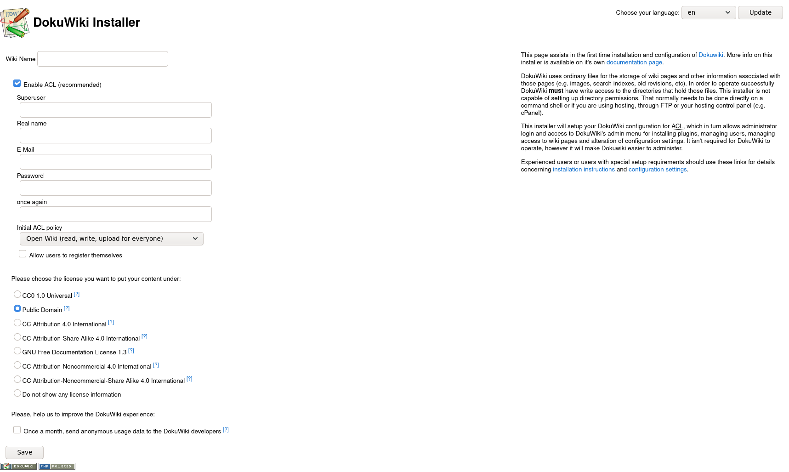

Running DokuWiki over I2P with Docker
=====================================

**UNFINISHED.**

How to host a DokuWiki as an I2P Site, using Docker and Java I2P. Writing
with a slightly different tone than my other guides, today I want to talk
a little more about "why" and it's going to give us a different take on
"how." This is not going to be my most "Professional" article ever, today
we're in this together and I'm making a case for my plan.

Docker is your f'in friend.
---------------------------

### Docker can make your life easier. Yes you.

Docker isn't just for systems administrators. If you let your computer run
any programs while you're not sitting there watching it, then Docker can
probably offer you something worthwhile. Besides "containing" your applications
within a stable, predictable, environment, which you can rebuild without interfering
with the environment in a running container, Docker provides a general way of
managing the lifecycle of your applications and dealing with crashes, sets up
containers on a network Bridge where they do not share the localhost address of the
host machine, and can manage data by attaching directories on the host to
directories within the container. Learning some basic Docker usage will help
you if it's your job(or hobby, whatever) to host a bunch of hidden services.
Besides that, if you're the type to share your hidden service setup instructions
with the community, it means that anyone on any OS can use them, as long
as they can install Docker. Oh also there's a freaking enormous community, every
question you ever had has probably already been asked and answered on some(probably
the wrong) StackExchange-adjacent site already.

So it pays to learn Docker. Or don't, its your life. But I would.

Highlights of Docker include:

 - Run on [Linux](https://docs.docker.com/get-docker/), [Mac OSX](https://docs.docker.com/docker-for-mac/install/),
  and [Windows](https://docs.docker.com/docker-for-windows/install/) without modification.
 - [An absolutely enormous repository of community packages, Dockerhub](https://hub.docker.com)
 - Automatically restart applications when they crash by passing `--restart=always`
  `docker run`
 - Volume management using either "named" volumes or directories on the
  host machine by passing the `--volume` and `--mount` flags
 - Network "Bridge" which attaches to the host indirectly, containers have
  their own IP addresses on this bridge, own ports, may have their own hostnames.
  Ports can be forwarded to the host machine using the `-p` flag.
 - Among many, many more reasons why Docker is pretty much ideal for hosting
  small hidden services.

Docker is really just another application, on most levels. Once you've used
it a few times it ceases to be confusing, you'll be passing pretty similar flags
to every single container you ever build or run, and only very rarely does it
ever get any more complex than the stuff you learn your first few weeks. It's like
`git`, it has lots of stuff to work with, but you end up using about the same six
options every time.

### Dockerhub maybe isn't always your best friend, but that's OK

Dockerhub could be considered a sort of Man in the Middle. Most of the
containers are build automatically on Docker's infrastructure, which means
that Dockerhub could in theory serve you up a bad image. This is pretty
unlikely, though, and not at all the biggest risk. The biggest risk is
that anybody can create a namespace and push an image to this infrastructure.
That namespace can't be racist, and it can't be occupied by another user
already, and I'm like, 85% sure it can't contain your typical "lookalike"
characters(Cyrillic O's and whatnot). Nothing stops anyone from registering
the namespace `mozzilla` though, or `mozil1a` or other legal characters that
resemble eachother.

The part of dockerhub which is undeniably useful, though, is the statistics
it generates on image usage, and its search capabilities. These are accessible
via the `docker search` command.

Here's a `docker search` example:

```bash
docker search dokuwiki
```

        NAME                           DESCRIPTION                                     STARS     OFFICIAL   AUTOMATED
        mprasil/dokuwiki               Container running DokuWiki with nice URLs an…   97                   [OK]
        linuxserver/dokuwiki                                                           59                   
        istepanov/dokuwiki             Docker image with dokuwiki and nginx. Suppor…   43                   [OK]
        vimagick/dokuwiki              A wiki application licensed under GPL 2 and …   14                   [OK]
        bambucha/dokuwiki              Alpine DokuWiki Docker Container                8                    [OK]
        crazymax/dokuwiki              DokuWiki image based on Alpine Linux            7                    
        plaguedr/dokuwiki              DokuWiki is a wiki application licensed unde…   2                    
        dtwardow/dokuwiki              DokuWiki Docker Container                       1                    [OK]

To avoid the risk of using a compromised upstream container, research the
source of the docker image. Pay attention to the `FROM` line of the `Dockerfile`, and
make sure that it corresponds to an "Official" signed base image from
a distro like Ubuntu, Debian, or Alpine Linux, or that it is from `SCRATCH`.
If it does not, find the source of the parent image, and repeat this process
until the whole stack of images is analyzed. In practice, this is rarely more
than one image.

To avoid the risk of using an out-of-date upstream container, build your image
locally, and all of the parent images as well, unless you are confident in the
upstream image being consistently maintained.

DokuWiki Decisions:
-------------------

### Why I chose DokuWiki

Choosing software which is easy to an instance of is setting yourself
up for success. Many hidden services are run by one person, if one is
lucky one has a backup or possibly a skeleton crew. Only a handful of
well-organized, mostly non-anonymous organizations have really reliable
teams of people to operate and maintain their sites and the hardware
that runs them.

This isn't wrong, and it doesn't have to be dangerous. It's also true
that many hidden services are operated by hobbyists, researchers, and
enthusiasts who simply want to host their services in a way which
transparently evades NAT difficulties. Many of them have small audiences
and even smaller numbers of contributors. It's not really my business to
know why they want to use the I2P network, my business it to show them
why it's a good option(Which it is). As long as the software you are
hosting is something you can keep up-to-date without breaking your back
or losing your job, then it's perfectly reasonable for just one person
to manage and host a hidden service, even on a residential connection.

This is the chief advantage of DokuWiki, especially combined with
Docker. There are no databases to set up, you can pre-configure the
administrative user and password, it honors the `http_proxy` environment
variable. There has never been a situation in which I had to lost
data stored in a DokuWiki to an update.

### Finding a DokuWiki Docker Image

Let's return to the `docker search` output from earlier for a moment,
because that's where we're going to start.

        NAME                           DESCRIPTION                                     STARS     OFFICIAL   AUTOMATED
        mprasil/dokuwiki               Container running DokuWiki with nice URLs an…   97                   [OK]
        linuxserver/dokuwiki                                                           59                   
        istepanov/dokuwiki             Docker image with dokuwiki and nginx. Suppor…   43                   [OK]
        vimagick/dokuwiki              A wiki application licensed under GPL 2 and …   14                   [OK]
        bambucha/dokuwiki              Alpine DokuWiki Docker Container                8                    [OK]

So what is this telling us, and what conclusions should we be drawing
from it?

`[Name]` This is just the name of the image, in the form `[namespace]/[name]`.
Often, this will be identical to the github or bitbucket namespace where the
image source is available. The namespace tends to reveal if the image is
maintained by an organization or by an individual. Obviously there are
advantages to choosing an image maintained by an organization.

`[Description]` The description of the image contains information additional
to the name. It's usually not the most interesting part of the `docker search`
output.

`[Stars]` As a rule, if only one person is using an image, it's probably
not up to date. Prioritize images with more users for research, stars will
be positively correlated to users, and users will be positively correlated
to eyes on the image, so prioritize images with the most stars.

`[Official]` Docker only has a handful of "official" images which are provided
by upstream distributions and software packages. Ubuntu, for instance, has an
official image:

        NAME                                                      DESCRIPTION                                     STARS     OFFICIAL   AUTOMATED
        ubuntu                                                    Ubuntu is a Debian-based Linux operating sys…   12481     [OK]       


`[Automated]` This means that the image was built on Docker's automated build
system, and not built on the developer's machine and pushed up to Dockerhub.

So, what images will we evaluate? The two that look the most promising are
`mprasil/dokuwiki`, and `linuxserver/dokuwiki`. `mprasil/dokuwiki` has a
[docker hub page here](https://hub.docker.com/r/mprasil/dokuwiki). At the top
it says "Updated a year ago" which is maybe not the best sign ever. On the other
hand, [linuxserver/dokuwiki](https://hub.docker.com/r/linuxserver/dokuwiki) was
updated less than a week ago. That's the one we need.

Before we continue, let's look at the `Dockerfile`s that describe the containers
which we will be running. First, the docker-dokuwiki `Dockerfile`:

 - [`Dockerfile 1`](https://github.com/linuxserver/docker-dokuwiki/blob/master/Dockerfile)

Uh-oh, looks like it's *not* from an official image or a `SCRATCH` image as we
recommended earlier. Instead, it modifies another image, the name suggests
that it combines `Alpine Linux` with an `nginx` web server. Let's look one level
deeper at the parent `Dockerfile`.

 - [`Dockerfile 2`](https://github.com/linuxserver/docker-baseimage-alpine-nginx/blob/master/Dockerfile)

Examining this `Dockerfile` confirms the suspicion that it combines Alpine linux witn
nginx and some modules. But we still haven't reached the base image, that's another level
down.

 - [`Dockerfile 3`](https://github.com/linuxserver/docker-baseimage-alpine/blob/master/Dockerfile)

At last we're here, and indeed each of the `Dockerfiles` looks non-malicious.

### Getting DokuWiki Configured

Setting up DokuWiki in a Docker container can be done in a couple simple steps.
The quickest way to get started is to just run a modified version of the command
from the linuxserver.io readme:

```bash
docker run -d \
  --name=dokuwiki \
  -e PUID=1000 \
  -e PGID=1000 \
  -e TZ=Europe/London \
  -p 127.0.0.1:8080:80 \
  -v $HOME/.config/dokuwiki:/config \
  --restart always \
  ghcr.io/linuxserver/dokuwiki
```

In this command, we remove the HTTPS port forward since it won't work over I2P
(for now) and we explicitly specifiy that we want to *only* listen on the localhost
with the HTTP port. This will allow us to safely listen locally without exposing our
service to devices on the LAN or on the Internet. It also specifies that the container
should always restart if it crashes, which will also cause it to start with the docker
daemon, and places the config directory in your `$HOME/.config/` directory.

But let's suppose that you want to re-build the whole stack of containers locally. In
order to do this, clone each individual parent container and re-build it with the same
name as it has on `ghcr.io`.

Start with the base image:

```bash
#! /bin/sh
WD=$(pwd)
git clone https://github.com/linuxserver/docker-baseimage-alpine
cd docker-baseimage-alpine
docker build -t ghcr.io/linuxserver/baseimage-alpine:3.14 .
cd "$WD"
```

Then the parent image:

```bash
#! /bin/sh
WD=$(pwd)
git clone https://github.com/linuxserver/docker-baseimage-alpine-nginx
cd docker-baseimage-alpine-nginx
docker build -t ghcr.io/linuxserver/baseimage-alpine-nginx:3.13 .
cd "$WD"
```

Finally, you can build the application image:

```bash
#! /bin/sh
WD=$(pwd)
git clone https://github.com/linuxserver/docker-dokuwiki
cd docker-dokuwiki
docker build -t ghcr.io/linuxserver/dokuwiki
cd "$WD"
```

And the run command will be identical to the one shown above. Once your container is
running, wait a few seconds and visit the
[http://127.0.0.1:8080/install.php](http://127.0.0.1:8080/install.php) to continue
setting up your DokuWiki. Finalizing the installation requires you to fill out one page
with information:

 - 

I2P Pro Tips:
-------------


Is this as big an elephant in the room as I think it is?
--------------------------------------------------------

